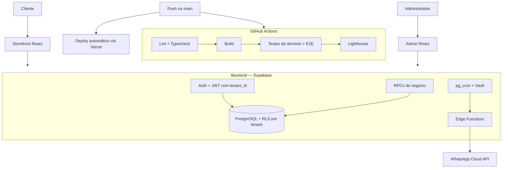

# Encanto — Plataforma de gestão e operação para alimentação

[](https://github.com/THDEV-WEB/Encanto-system/actions/workflows/ci.yml)


Sistema web e Android desenvolvido para a operação real de uma marmitaria/açaí, com
arquitetura multi-tenant, painel administrativo, checkout, autenticação, segurança por
Row Level Security, testes automatizados e CI/CD.

**Stack principal:** React + Vite · Supabase (Postgres, Auth, RLS, RPCs, Edge Functions) ·
Capacitor/Android · GitHub Actions · Vercel

**Em produção:** https://encanto.valionsistemas.com.br

## Visão geral

O Encanto nasceu como o sistema de uma marmitaria/açaí e evoluiu para uma plataforma
multi-tenant mantida pela VALION SISTEMAS, capaz de operar mais de uma loja sobre a
mesma base de código. O frontend é dividido em bundles independentes para loja
(storefront), painel administrativo e onboarding de administradores, todos consumindo
o mesmo backend Supabase. A separação entre cliente e loja é resolvida pelo domínio da
requisição, e o isolamento de dados entre lojas é garantido em nível de banco, não
apenas na aplicação.

## Produção

O sistema está ativo em [encanto.valionsistemas.com.br](https://encanto.valionsistemas.com.br),
atendendo pedidos reais. A arquitetura multi-tenant já está em produção e suporta o
provisionamento de novas lojas sobre a mesma infraestrutura.

## Principais capacidades

- **Storefront** — catálogo por categorias, busca com tolerância a acentuação, carrinho,
  cálculo de taxa de entrega por distância viária e horário de funcionamento dinâmico por loja.
- **Checkout e pedidos** — endereço estruturado com autocomplete, envio automático do
  resumo do pedido via WhatsApp do próprio cliente ao finalizar a compra, e
  acompanhamento de status do pedido na área do cliente.
- **Conta do cliente** — histórico de pedidos, recompra e programa de fidelidade.
- **Painel administrativo** — gestão de catálogo, pedidos, comanda térmica e relatórios
  (faturamento, produtos mais vendidos, formas de pagamento, entrega x retirada).
- **Console de plataforma** — administração de lojas (tenants), provisionamento e
  identidade visual por loja.
- **Aplicativo Android** — build nativo via Capacitor, distribuído via APK, com
  integração customizada para impressora térmica.

## Arquitetura

Cliente e administrador consomem bundles React separados, ambos falando com o mesmo
projeto Supabase. Autenticação e isolamento por loja (Row Level Security) protegem o
acesso aos dados; operações de negócio sensíveis — como criação de pedido, ajustes de
fidelidade e exclusão de dados por LGPD — são centralizadas em RPCs no Postgres.
Expurgo de dados e o processamento de uma fila de notificações via WhatsApp rodam de
forma assíncrona no próprio banco (`pg_cron` + `Vault`), sem depender de um worker
externo.



GitHub Actions e Vercel são dois caminhos independentes disparados pelo mesmo push na
`main` — o CI não aciona o deploy, e nenhum dos dois acessa o Postgres de produção: o
CI roda contra um projeto Supabase dedicado a testes. Testes que dependem de um projeto
Supabase real (RLS, schema) rodam à parte, fora do pipeline automático.

## Stack

| Camada | Tecnologias |
|---|---|
| Frontend | React 18, Vite 5, service worker via `vite-plugin-pwa` |
| Mobile | Capacitor 8, projeto Android nativo com plugin customizado de impressora térmica |
| Backend | Supabase — Postgres, Auth, Row Level Security, RPCs, Edge Functions (Deno) |
| Automação | `pg_cron` + `Vault` (fila de notificações, expurgo de dados) |
| Observabilidade | Sentry (erros e performance) |
| Testes | Testes de domínio em Node puro, Playwright (E2E) |
| CI/CD | GitHub Actions, Lighthouse CI |
| Deploy | Vercel |

## Multi-tenancy e segurança

- **Supabase Auth** para autenticação de clientes e administradores.
- **JWT com `tenant_id`** — um hook customizado no banco injeta a loja ativa nas claims
  do token no momento do login, sem depender de um valor enviado pelo client.
- **Row Level Security por tenant** nas tabelas sensíveis (pedidos, clientes, endereços,
  configurações de loja), garantindo isolamento de dados entre lojas no próprio banco.
- **RPCs para operações de negócio sensíveis** (ex.: criação de pedido, resolução de
  loja por domínio, ajustes de fidelidade, exclusão de dados por LGPD).
- **Rate limiting em nível de banco** protegendo endpoints públicos usados por usuários
  não autenticados.
- **CSP e security headers** configurados no deploy.
- **Edge Functions** isolando as poucas operações que exigem privilégio elevado,
  delegando a decisão de autorização para o banco.
- **Observabilidade de erros** com Sentry, com Error Boundaries dedicados no frontend.

## Qualidade e testes

- **~88 testes de domínio e infraestrutura** em Node puro (sem framework de testes),
  cobrindo regras de negócio como precificação, adicionais, fidelidade, horário de
  funcionamento, endereço e políticas de RLS.
- **47 especificações Playwright** cobrindo Admin, autenticação, conta do cliente,
  checkout, storefront público e carrinho.
- **ESLint, Prettier e verificação de tipos** configurados no projeto.

## CI/CD

O GitHub Actions roda a cada push e pull request para `main`, com jobs para lint e
verificação de tipos, build, testes de domínio, testes end-to-end (Playwright/Chromium)
e Lighthouse CI (limite mínimo de performance). O build do aplicativo Android é gerado
sob demanda, em workflow separado. O deploy para produção acontece automaticamente via
integração nativa entre Vercel e o repositório.

## Estrutura do repositório

```
encanto-react/
  src/
    address/         # domínio de endereço: geocoding, autocomplete, validação
    components/
      admin/          # telas e componentes do painel administrativo
      ...
    contexts/, hooks/, providers/, services/, utils/
    App.jsx           # entry point da loja (storefront)
    AdminApp.jsx       # entry point do painel administrativo
    ConviteApp.jsx      # onboarding de administradores
  migrations/          # migrations SQL, com rollback pareado
  supabase/functions/   # Edge Functions (Deno)
  tests/                # testes de domínio (Node)
  scripts/              # testes de infraestrutura e RLS
  e2e/                  # especificações Playwright
  docs/                 # arquitetura e decisões técnicas
  .github/workflows/     # CI
```

## Decisões técnicas relevantes

- **Modularização incremental do frontend** — o arquivo principal da aplicação foi
  reduzido de quase 4 mil linhas para menos de 150, extraído em módulos por domínio ao
  longo de várias iterações, cada uma validada antes de avançar para a próxima.
- **Resolução de loja por domínio** — cada tenant é identificado pelo hostname da
  requisição, permitindo multi-loja sem depender de um identificador enviado pelo
  client.
- **Autorização centralizada no banco** — regras de negócio sensíveis (criação de
  pedido, vínculo de administrador a uma loja) ficam em RPCs no Postgres, não
  espalhadas pelo frontend.
- **Automação assíncrona no próprio Postgres** — expurgo de dados e o disparo de uma
  fila de notificações via WhatsApp Cloud API (usando `pg_net`) rodam por
  `pg_cron`/`Vault`, sem depender de um worker externo.

## Execução local

```bash
npm install
npm run dev            # sobe a loja (storefront) em modo desenvolvimento
npm run build           # build de produção
npm run test:domain     # testes de domínio (Node)
npm run test:e2e        # testes end-to-end (Playwright/Chromium)
```

Variáveis de ambiente (`.env`, a partir de `.env.example`):

```env
VITE_SUPABASE_URL=
VITE_SUPABASE_KEY=
VITE_RPC_TIMEOUT=
VITE_SENTRY_DSN=
VITE_MAPBOX_TOKEN=
```

## Estado atual e limitações

- Em operação real, atendendo pedidos de uma loja principal; a arquitetura multi-tenant
  já está em produção e suporta múltiplas lojas sobre a mesma base.
- O CI executa os testes end-to-end no Chromium; Firefox e WebKit têm suporte
  configurado no Playwright, mas não rodam por padrão no pipeline.
- Testes que validam Row Level Security contra um projeto Supabase real rodam
  separadamente do pipeline automático, pois exigem conexão a um banco dedicado.
- O aplicativo Android é distribuído via APK direto, sem publicação em loja de
  aplicativos.
- A fila de notificações de status via WhatsApp Cloud API (`pg_cron` + `Vault`) está
  implementada e validada em ambiente de teste; a ativação do número oficial da loja
  depende de uma etapa de coexistência com o WhatsApp Business App já em uso nele,
  ainda não concluída. A confirmação automática do pedido pelo próprio WhatsApp do
  cliente, no checkout, é independente disso e já está em produção.

## Autoria

Desenvolvido por Thiago Luiz Severino da Silva — VALION SISTEMAS
